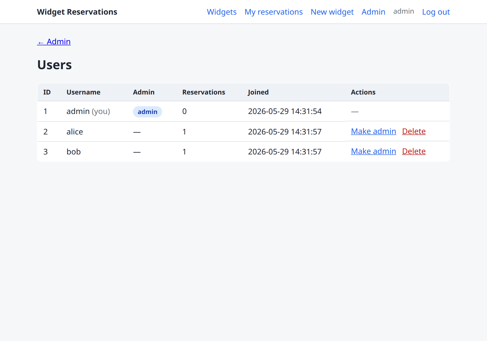
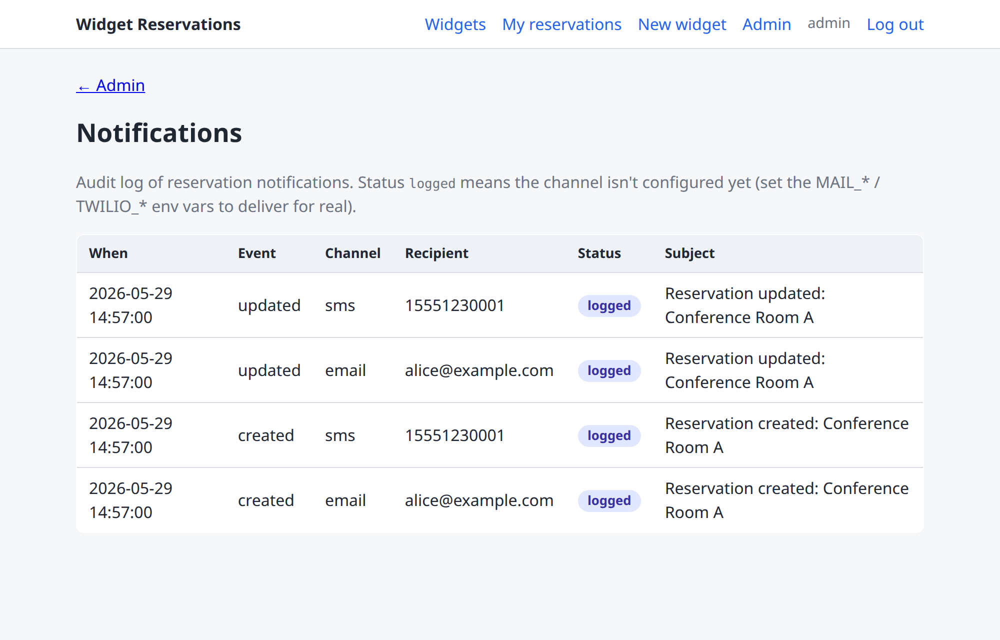

# Widget Reservations


A small reservation system built with **Python, Flask, and SQLite**. Users register and
log in, browse **widgets** (any bookable resource), and reserve a widget for a time range.
Overlapping reservations for the same widget are rejected. It ships with both a
server-rendered web UI and a JSON API, and is served with **gunicorn**.


## Features

- Username/password accounts (session login + password hashing via Werkzeug)
- Widgets: anyone can browse; logged-in users can create them
- Reservations: book a widget for a `start`/`end` time, with overlap prevention
- Web UI (Jinja templates) **and** a JSON API under `/api`
- API accepts either the session cookie or HTTP Basic auth
- Admin control panel at `/admin` to manage users, widgets, and reservations
- Self-service account page (`/account`): update your email/phone and change your password
- CSV export of reservations (optionally filtered by date / widget / user)
- Email + SMS notifications when a reservation is created, changed, or cancelled

## Setup

Python 3.12. Create a virtual environment and install dependencies:

```bash
python3 -m venv .venv
source .venv/bin/activate
pip install -r requirements.txt
```

The SQLite database is created automatically on first run at
`instance/reservations.sqlite`. To reset it explicitly:

```bash
flask --app app init-db
```

## Run

Production-style, with gunicorn (the WSGI entrypoint is `wsgi:app`):

```bash
SECRET_KEY="$(python -c 'import secrets; print(secrets.token_hex(32))')" \
  gunicorn -w 4 -b 127.0.0.1:8000 wsgi:app
```

Then open http://127.0.0.1:8000/.

For local development with auto-reload you can instead use Flask's server:

```bash
flask --app app run --debug
```

## Admin

Admins get a control panel at `/admin` to manage **users** (edit username/email/phone,
reset password, grant/revoke admin, delete), **widgets** (edit, delete), and
**reservations** (delete any entry). The panel and its nav link are visible only to admin
users. Every signed-in user can also manage their own email, phone, and password from the
**Account** page (`/account`).

Create the first admin from the command line, then log in normally:

```bash
flask --app app create-admin alice s3cret      # new admin user
flask --app app set-admin bob                   # grant admin to an existing user
flask --app app set-admin bob --remove          # revoke it
```



## Reports

Admins can export reservations as CSV from **Admin → Reservations → Export CSV**, or
directly:

```
GET /admin/reports/reservations.csv?from=2026-06-01&to=2026-06-30&widget_id=1&user_id=2
```

All query parameters are optional. `from`/`to` are `YYYY-MM-DD` dates filtered against the
reservation start time (inclusive). The file has one row per reservation with the widget,
user, time range, note, and creation timestamp.

## Notifications

When a reservation is **created, changed, or cancelled**, the owner is notified on every
channel they have contact info for (email and/or SMS — captured optionally at registration).

The mechanism is pluggable and configured entirely through environment variables. When a
channel isn't configured, the message is written to the application log and an audit row is
still recorded, so the feature works out of the box without any credentials. Every attempt
(`sent` / `failed` / `logged` / `skipped`) is visible to admins at **Admin → Notifications**.
A failed send never blocks the booking.

| Variable | Channel | Notes |
| --- | --- | --- |
| `MAIL_SERVER`, `MAIL_FROM` | Email | Required to enable email (SMTP) |
| `MAIL_PORT`, `MAIL_USERNAME`, `MAIL_PASSWORD`, `MAIL_USE_TLS` | Email | Optional (port defaults to 587, TLS on) |
| `TWILIO_ACCOUNT_SID`, `TWILIO_AUTH_TOKEN`, `TWILIO_FROM` | SMS | All three required to enable SMS (Twilio) |

```bash
# example: enable real email delivery
MAIL_SERVER=smtp.example.com MAIL_FROM=reservations@example.com \
MAIL_USERNAME=apikey MAIL_PASSWORD=secret \
  gunicorn -w 4 -b 127.0.0.1:8000 wsgi:app
```



## API

`POST`/`PUT`/`DELETE` endpoints require authentication (session cookie or HTTP Basic).
`GET` endpoints for widgets are public.

| Method | Path | Auth | Description |
| --- | --- | --- | --- |
| GET | `/api/widgets` | no | List widgets |
| POST | `/api/widgets` | yes | Create a widget (`{name, description}`) |
| GET | `/api/widgets/<id>` | no | Widget detail + its reservations |
| GET | `/api/widgets/<id>/reservations` | no | List a widget's reservations |
| POST | `/api/widgets/<id>/reservations` | yes | Reserve (`{start_time, end_time, note}`) — `409` on overlap |
| GET | `/api/reservations` | yes | List the current user's reservations |
| PUT | `/api/reservations/<id>` | yes | Change your reservation (`{start_time, end_time, note}`) — `409` on overlap |
| DELETE | `/api/reservations/<id>` | yes | Cancel your reservation |

Times accept `YYYY-MM-DDTHH:MM` or `YYYY-MM-DD HH:MM` and are stored/returned as
`YYYY-MM-DD HH:MM`.

### Example

```bash
# create a widget with HTTP Basic auth
curl -u alice:secret -X POST http://127.0.0.1:8000/api/widgets \
  -H 'Content-Type: application/json' \
  -d '{"name": "Conference Room", "description": "Seats 8"}'

# reserve it
curl -u alice:secret -X POST http://127.0.0.1:8000/api/widgets/1/reservations \
  -H 'Content-Type: application/json' \
  -d '{"start_time": "2026-06-01T09:00", "end_time": "2026-06-01T10:00"}'
```

## Tests

```bash
pip install -r requirements-dev.txt
pytest
```

## Project layout

```
app/
  __init__.py      app factory; auto-creates the DB on first run
  db.py            SQLite connection + init-db CLI command
  schema.sql       user / widget / reservation tables
  models.py        data access + overlap check (raises OverlapError)
  utils.py         datetime parsing/normalization
  auth.py          register/login/logout + login_required / admin_required / api_auth_required
  web.py           server-rendered UI routes
  api.py           JSON API routes (/api)
  admin.py         admin control panel routes (/admin) + CSV export + notifications log
  notifications.py email (SMTP) + SMS (Twilio) channels with log/audit fallback
  templates/       Jinja templates
  static/style.css styling
tests/             pytest suite
wsgi.py            gunicorn entrypoint (wsgi:app)
```

## Contributing

Contributions are welcome — see [CONTRIBUTING.md](CONTRIBUTING.md) for setup, testing,
and pull request guidelines.

## License

Released under the [MIT License](LICENSE).
